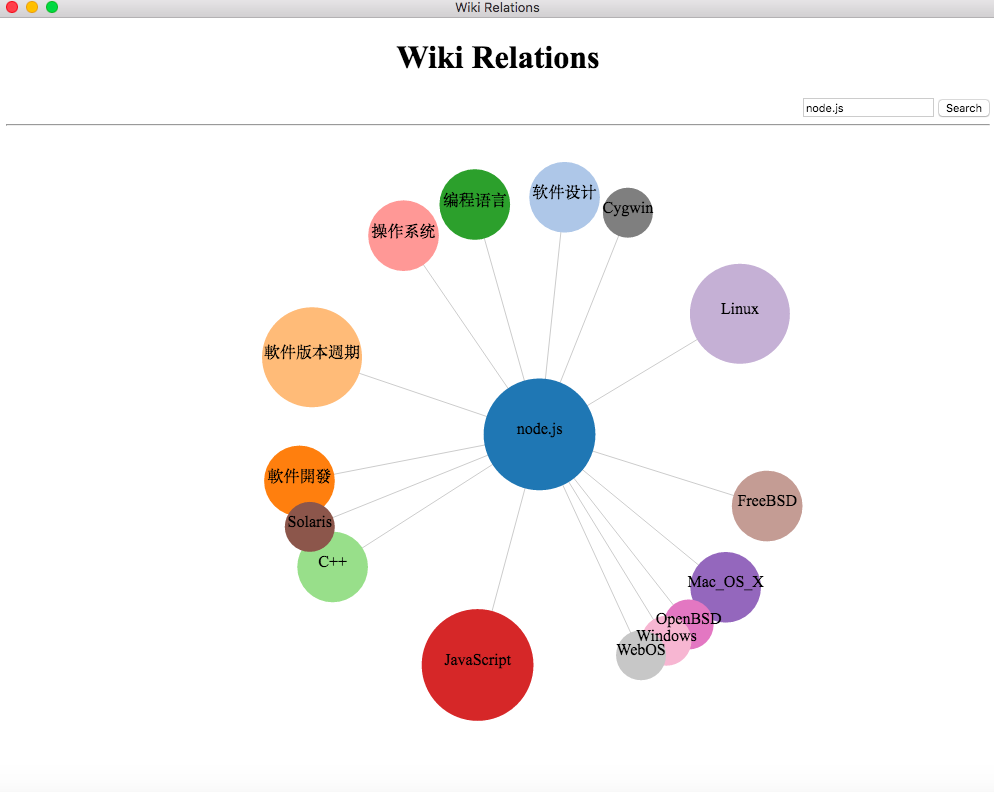

# wikiRelations
Relations of wiki items

### How To Use

1. Clone this repository. `git clone https://github.com/banyudu/wikiRelations.git`
2. `$ cd wikiRelations`
3. `$ npm install && npm start`

If you are in China, you may want to use [cnpm](https://github.com/cnpm/cnpm) instead of npm.

### Preview

### Powered By

1. [electron](https://github.com/electron/electron)
2. [jQuery](https://github.com/jquery/jquery)
3. [d3.js](https://github.com/d3/d3)
4. [less.js](https://github.com/less/less.js)
